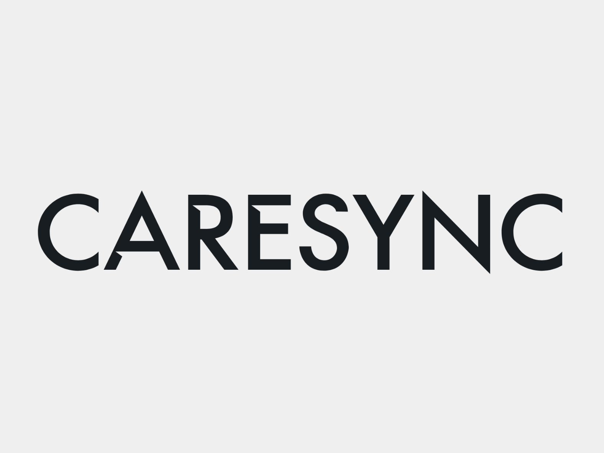
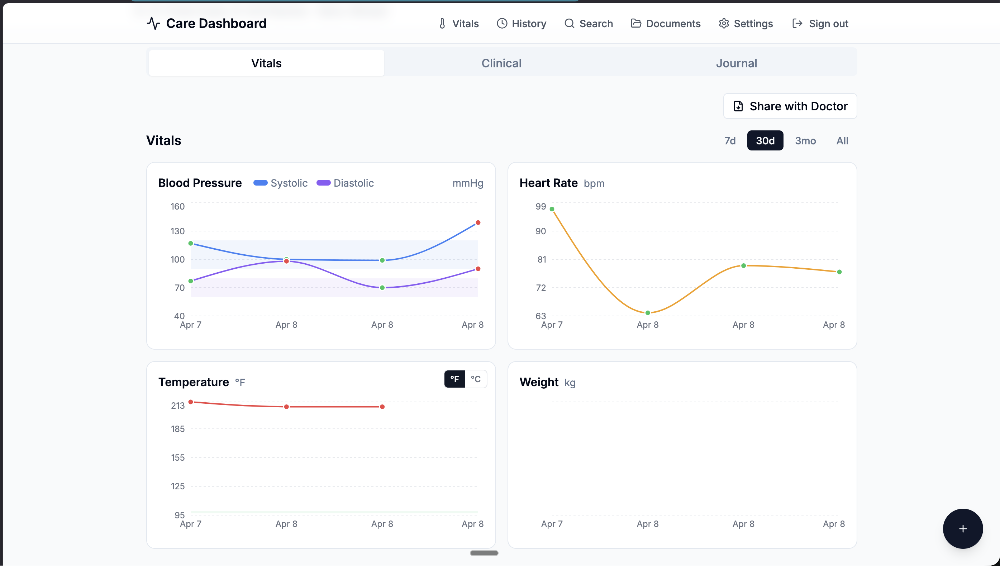
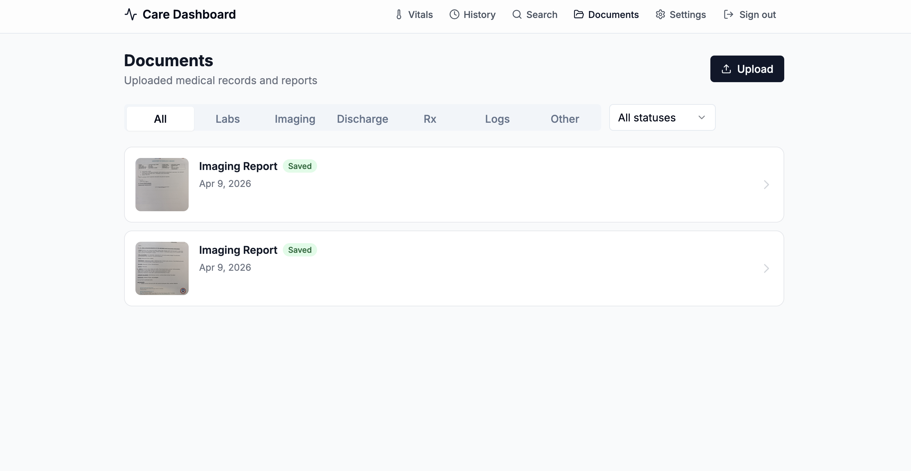
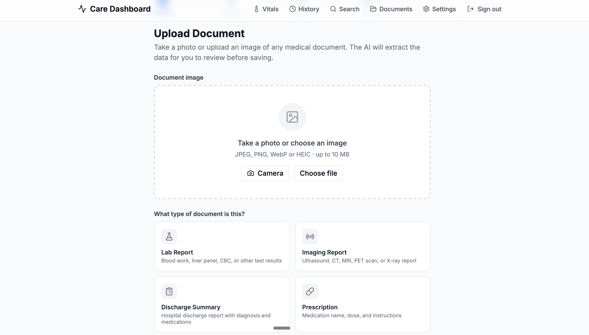
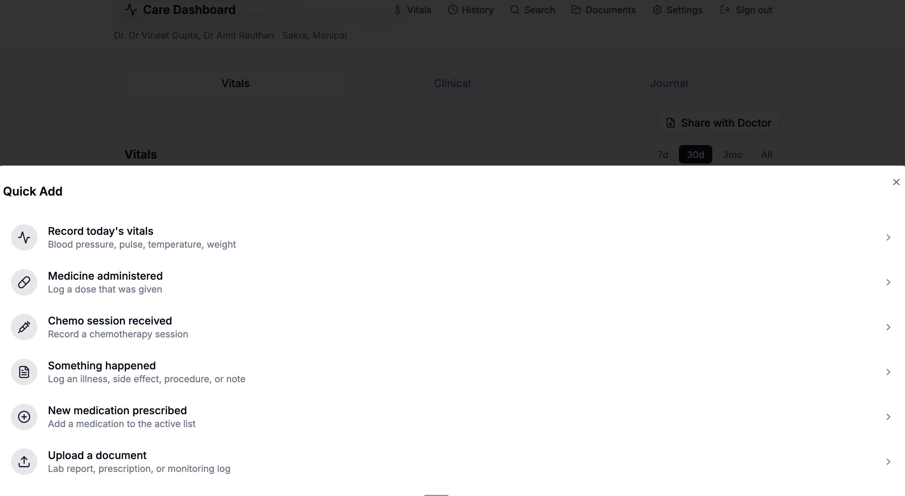

# CareSync

<p align="center">
  
</p>

**A mobile-first cancer patient care dashboard with AI-powered document ingestion.**

Built for a single family's real-world use — tracking vitals, medications, chemo sessions, lab results, and imaging reports for a loved one undergoing cancer treatment.

> **Note:** The full implementation remains private due to patient confidentiality. This repository showcases the architecture, design decisions, and selected code excerpts.

---

## Screenshots

<table>
  <tr>
    <td align="center">
      <br/>
      <sub><b>Vitals Dashboard</b> — Blood pressure, heart rate, temperature (°F/°C toggle) and weight trend charts with color-coded normal ranges</sub>
    </td>
    <td align="center">
      <br/>
      <sub><b>Document Library</b> — All ingested medical records filterable by type: Labs, Imaging, Discharge, Rx, Logs</sub>
    </td>
  </tr>
  <tr>
    <td align="center">
      <br/>
      <sub><b>Upload Flow</b> — Photograph any hospital document; select its type and the AI extracts all fields automatically</sub>
    </td>
    <td align="center">
      <br/>
      <sub><b>Quick Add</b> — One-tap logging for vitals, medications, chemo sessions, events, and document uploads</sub>
    </td>
  </tr>
</table>

---

## The Problem

Managing cancer treatment generates a flood of paper: lab reports, imaging scans, discharge summaries, prescriptions, and daily monitoring logs. Information is scattered across hospital printouts, handwritten notes, and WhatsApp photos. Spotting trends (a rising liver enzyme, a dropping platelet count) requires manually cross-referencing dozens of documents.

CareSync turns a phone camera into a structured medical record.

## How It Works

```
┌──────────────┐     ┌──────────────┐     ┌──────────────┐     ┌──────────────┐
│  Phone Camera │────▶│  Upload Flow  │────▶│  LLM Vision   │────▶│  Review UI   │
│  (Photo/PDF)  │     │  (Next.js)   │     │  (OpenRouter) │     │  (Editable)  │
└──────────────┘     └──────────────┘     └──────────────┘     └──────┬───────┘
                                                                       │
                                                                       ▼
                          ┌──────────────┐     ┌──────────────┐     ┌──────────────┐
                          │  Dashboard   │◀────│  PostgreSQL  │◀────│  Save to DB  │
                          │  (Charts)    │     │  (Supabase)  │     │  (API Route) │
                          └──────────────┘     └──────────────┘     └──────────────┘
```

1. **Upload** a photo of a hospital document (lab report, ultrasound report, discharge summary, prescription, or monitoring log)
2. **AI extraction** — an LLM with vision reads the document and outputs structured JSON with per-field confidence scores
3. **Human review** — every extracted field is shown with its confidence; low-confidence fields (< 0.7) are flagged for manual correction
4. **Persist** — reviewed data is saved to the appropriate PostgreSQL tables via server-side API routes
5. **Visualize** — charts, timelines, and tables surface trends across all ingested data

---

## Tech Stack

| Layer | Technology | Why |
|---|---|---|
| Framework | **Next.js 14** (App Router) | Server components, API routes, middleware auth — one codebase |
| Language | **TypeScript** (strict mode) | Zero `any` — every extraction shape, DB row, and API response is typed |
| Styling | **Tailwind CSS** + **shadcn/ui** | Mobile-first from 375px up; consistent design tokens |
| Charts | **Recharts** | Composable SVG charts with custom domains, dual-unit axes |
| Database | **Supabase** (PostgreSQL + Storage + Auth) | Row-level security, signed URLs for document images, built-in auth |
| AI/LLM | **OpenRouter API** | Multi-provider access; primary: Gemini 2.0 Flash, fallback: Claude 3.5 Sonnet |
| Hosting | **Vercel** | Auto-deploy from `main`, edge middleware for auth |

---

## Features

### Document Ingestion (5 document types)

- **Lab Reports** — extracts every test row: name, value, unit, reference range, flag (H/L/#), method, specimen type, grouped by panel
- **Imaging Reports** — organ-by-organ findings, measurements with units, impression, radiologist, modality (US/CT/MRI/PET)
- **Discharge Summaries** — multi-page support; extracts diagnosis (with TNM staging), medications, embedded lab results, treatment course, follow-up advice
- **Prescriptions** — drug, dose, frequency, route, prescriber, indication
- **Monitoring Logs** — BP, pulse, temperature, weight from handwritten hospital charts

### Vitals Tracking

- Manual entry with **Fahrenheit input** and live Celsius preview
- Charts with F/C toggle (Fahrenheit default)
- Color-coded normal ranges: green (normal), amber (borderline ±10%), red (abnormal)
- Blood pressure, pulse, temperature, and weight trend lines

### Confidence-Scored Extraction

Every field extracted by the LLM carries a confidence score (0.0–1.0). The review UI highlights fields below `LOW_CONFIDENCE_THRESHOLD = 0.7` so the caregiver knows exactly what to double-check.

---

## Architecture Deep Dive

### Two-Phase Extraction

The ingestion pipeline separates **raw extraction** from **structured persistence**:

- **Phase 1** — The LLM returns a single JSON blob. This raw JSON is stored verbatim in `documents.raw_extracted_json`. If the schema changes later, Phase 2 can be re-run without re-calling the LLM.
- **Phase 2** — A `rebuildExtractedData()` function maps the raw JSON into the correct database tables (lab_results, imaging_reports, discharge_summaries, etc.). This is repeatable and deterministic.

### Multi-Provider LLM Client

The OpenRouter integration uses the standard OpenAI SDK with a swapped `baseURL`. If the primary model fails, the system automatically retries with a fallback model before surfacing an error:

```typescript
// lib/openrouter.ts — Multi-provider LLM client with automatic fallback

import OpenAI from 'openai'

export const openrouter = new OpenAI({
  baseURL: 'https://openrouter.ai/api/v1',
  apiKey: process.env.OPENROUTER_API_KEY,
  defaultHeaders: {
    'HTTP-Referer': 'https://cancer-dashboard.vercel.app',
    'X-Title': 'Cancer Patient Care Dashboard',
  },
})

export const DEFAULT_MODEL  = 'google/gemini-2.0-flash-001'
export const FALLBACK_MODEL = 'anthropic/claude-3.5-sonnet'

export async function extractWithVision(
  imageUrl: string,
  prompt: string,
  modelOverride?: string,
): Promise<{ content: string; modelUsed: string }> {
  const primaryModel = modelOverride?.trim() || DEFAULT_MODEL

  const attemptExtraction = async (model: string): Promise<string> => {
    const response = await openrouter.chat.completions.create({
      model,
      messages: [{
        role: 'user',
        content: [
          { type: 'image_url', image_url: { url: imageUrl } },
          { type: 'text', text: prompt },
        ],
      }],
      max_tokens: 4096,
    })
    const content = response.choices[0]?.message?.content
    if (!content) throw new Error('Empty response from model')
    return content
  }

  try {
    return { content: await attemptExtraction(primaryModel), modelUsed: primaryModel }
  } catch {
    // Automatic fallback to secondary model
    return { content: await attemptExtraction(FALLBACK_MODEL), modelUsed: FALLBACK_MODEL }
  }
}
```

### Confidence-Typed Extraction

Every extracted field is wrapped in a `ConfidenceValue<T>` — a generic type that pairs any value with a 0–1 confidence score from the LLM:

```typescript
// components/upload/types.ts — Per-field confidence scoring

/** A single extracted value with a confidence score (0–1). */
export interface ConfidenceValue<T> {
  value: T
  confidence: number // 0.0 (illegible) → 1.0 (certain)
}

export interface ExtractedLabItem {
  panel_name: ConfidenceValue<string | null>
  test_name:  ConfidenceValue<string | null>
  value:      ConfidenceValue<string | null>
  unit:       ConfidenceValue<string | null>
  reference_range: ConfidenceValue<string | null>
  flag:       ConfidenceValue<string | null>  // "H", "L", "#", or null
  method:     ConfidenceValue<string | null>
  specimen_type: ConfidenceValue<string | null>
}

// 6 document types: lab_report | imaging_report | prescription
//                   | monitoring_log | discharge_summary | other
export type ExtractedData =
  | ExtractedLabReport
  | ExtractedPrescription
  | ExtractedMonitoringLog
  | ExtractedImagingReport
  | ExtractedDischargeSummary
  | ExtractedOther

// Fields below this threshold are flagged for manual review
export const LOW_CONFIDENCE_THRESHOLD = 0.7
```

### Color-Coded Normal Ranges

A unified `getValueStatus()` function drives the traffic-light color system across all charts, tables, and cards:

```typescript
// lib/normalRanges.ts — Semantic color system for medical values

export function getValueStatus(
  value: number,
  range: NormalRange,
): 'normal' | 'borderline' | 'abnormal' {
  const { low, high } = range
  const span = high - low
  const margin = span * 0.1  // 10% buffer = borderline zone

  if (value >= low && value <= high) return 'normal'
  if (value >= low - margin && value <= high + margin) return 'borderline'
  return 'abnormal'
}

// Applied everywhere:
//   normal     → green-500  (#22c55e)
//   borderline → amber-500  (#f59e0b)
//   abnormal   → red-500    (#ef4444)
```

### Domain-Specific Extraction Prompts

Each of the 6 document types has a carefully tuned prompt that enforces the exact JSON schema the review UI expects. The prompts were iterated against real Indian hospital documents — both printed and handwritten:

```typescript
// app/api/extract/route.ts — One of 6 extraction prompts (lab reports)

const LAB_REPORT_PROMPT = `You are a medical document parser.
Extract all lab test results from this image.

Return ONLY a valid JSON object — no markdown, no explanation.

Rules:
- Extract EVERY test result visible across ALL pages.
- Group tests by their panel heading (e.g. "LIVER FUNCTION TEST", "CBC").
- Keep the value as a string exactly as printed (do not convert).
- Keep reference ranges as the full string (e.g. "[0-1.0]", "<0.20]").
- Flag should be "H" (high), "L" (low), "#" (critical), or null.
- Use null for any field not present or illegible.
- Do NOT invent or estimate values — only extract what is visible.`
```

---

## Database Schema

9 core tables + 4 migration-added tables, all with row-level security:

```
patient              → Single patient record
├── vital_signs      → BP, pulse, temp (°C in DB), weight
├── medications      → Active/completed meds
│   └── medication_events  → Dose tracking
├── chemo_sessions   → Cycle number, drugs, duration, reactions
├── lab_runs         → Groups lab_results by date/panel
│   └── lab_results  → Individual test rows with flags
├── treatments       → Treatment phases/protocols
├── events           → Journal entries, appointments, notes
├── documents        → Uploaded files + raw_extracted_json
├── imaging_reports  → Structured radiology data
└── discharge_summaries → Multi-page hospital summaries
```

All mutations route through Next.js API routes (13 modules) — the browser never touches the Supabase service role key.

---

## Project Stats

| Metric | Value |
|---|---|
| TypeScript source files | 99 |
| Lines of code | ~13,800 |
| API route modules | 13 |
| Document types supported | 6 |
| Supabase migrations | 4 |
| LLM extraction prompts | 6 |
| Build errors | 0 |

---

## Security Model

- **No signup page** — user accounts are created manually in the Supabase dashboard (deliberate choice; this is a single-family tool)
- **Row-level security** on every table — only authenticated users can read/write
- **Service role key** is server-only — all mutations go through Next.js API routes
- **LLM API key** is server-only — extraction happens in API routes, never client-side
- **Signed URLs** for document images — 10-year expiry, generated server-side

---

## Local Development

```bash
# Prerequisites: Node.js 18+, npm, Supabase project

# Install dependencies
npm install

# Set up environment variables
cp .env.example .env.local
# Fill in: NEXT_PUBLIC_SUPABASE_URL, NEXT_PUBLIC_SUPABASE_ANON_KEY,
#          SUPABASE_SERVICE_ROLE_KEY, OPENROUTER_API_KEY

# Apply database migrations
# Run each file in supabase/migrations/ in the Supabase SQL Editor

# Start dev server
npm run dev

# Type-check
npx tsc --noEmit

# Build
npm run build
```

---

## Status

This is an active project in daily use. Current work:
- Multi-image upload UI for discharge summaries (multi-page documents)
- Trend analysis across lab results over time
- PDF export of patient summaries

---

## Author

**Suneet Puri** — [github.com/spunfromsun](https://github.com/spunfromsun)

Built with care for family.

---

*The full source code is private to protect patient data. If you'd like to discuss the architecture or implementation, feel free to reach out.*
